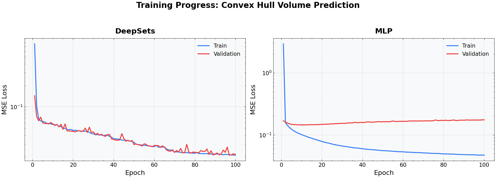
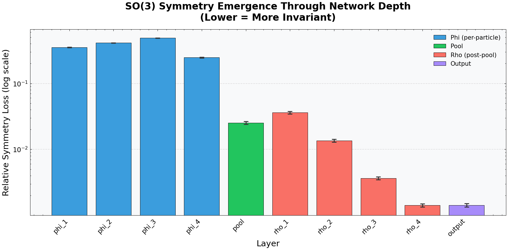
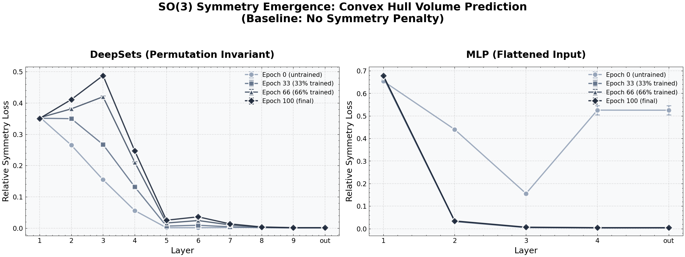

# SO(3) Symmetry Emergence in Convex Hull Volume Prediction

## Overview

This analysis investigates how SO(3) rotational symmetry emerges through the layers of neural networks trained to predict convex hull volumes. The convex hull volume of a set of 3D points is inherently **SO(3) invariant** — rotating all points by the same rotation matrix preserves the volume.

We compare two architectures:
1. **DeepSets**: A permutation-invariant architecture designed for set-structured data
2. **MLP**: A standard multilayer perceptron with flattened input

Both models are trained **without explicit symmetry penalties** (baseline) to observe how symmetry naturally emerges through learning.

## Methods

### Task: Convex Hull Volume Prediction

- **Input**: Set of 50 random 3D points sampled uniformly from a [-1, 1]³ cube
- **Output**: Volume of the convex hull (computed via `scipy.spatial.ConvexHull`)
- **Dataset**: 10,000 samples split 60/20/20 for train/val/test

### Architectures

#### DeepSets
A permutation-invariant architecture with three components:
- **Phi (φ)**: Per-point encoder MLP applied independently to each point
  - Architecture: 3 → 64 → 64 → 64 → 64 (4 layers)
- **Pool**: Sum aggregation over all points
- **Rho (ρ)**: Set-level decoder MLP
  - Architecture: 64 → 64 → 64 → 32 → 1 (4 layers)

#### MLP (Baseline)
Standard MLP with flattened input:
- Architecture: 150 → 128 → 64 → 32 → 1
- Input: All 50 points concatenated into a 150-dimensional vector

### Symmetry Loss Metric

We measure **relative symmetry loss** at each layer:

$$\mathcal{L}_{\text{sym}} = \frac{\|h(Rx) - h(R'x)\|^2}{\|h(Rx)\|^2 + \|h(R'x)\|^2 + \epsilon}$$

Where:
- $R, R'$ are random SO(3) rotation matrices
- $h(\cdot)$ is the activation at a given layer
- The loss is averaged over multiple rotation pairs and batch samples

**Key distinction for DeepSets**: 
- For **phi layers** (before pooling): Compute per-point loss, then average across all 50 points
- For **rho layers** (after pooling): Standard loss on aggregated embeddings

### Training Protocol

- **Optimizer**: AdamW (lr=3×10⁻⁴, no weight decay)
- **Epochs**: 100
- **Batch size**: 128
- **Checkpoints**: Saved at epochs 0, 33, 66, and 100

---

## Results

### 1. Training Dynamics

| Metric | DeepSets | MLP |
|--------|----------|-----|
| Final Train Loss | ~0.02 | ~0.04 |
| Final Val Loss | ~0.02 | ~0.2 |
| Generalization | ✓ Good | ✗ Overfitting |

**Key Finding**: The MLP exhibits severe overfitting — training loss continues to decrease while validation loss plateaus around 0.2. This is because the MLP must learn permutation invariance from data alone (50! possible orderings), which is fundamentally intractable.

DeepSets achieves good generalization because permutation invariance is built into the architecture.

### 2. Layerwise Symmetry Emergence

The bar chart shows relative symmetry loss (log scale) at each layer of the trained DeepSets model:

| Layer Type | Layers | Symmetry Loss | Interpretation |
|------------|--------|---------------|----------------|
| **Phi** (per-particle) | phi_1 → phi_4 | ~0.2 - 0.5 | High variance under rotation |
| **Pool** | pool | ~0.02 | Dramatic 10× reduction |
| **Rho** (post-pool) | rho_1 → rho_4 | 0.003 - 0.04 | Low and decreasing |
| **Output** | output | ~0.002 | Near-perfect invariance |

**Key Finding**: The pooling operation is where SO(3) invariance "emerges." Before pooling, per-point embeddings are not rotation-invariant. After sum pooling, the aggregated representation becomes nearly invariant because:

$$\sum_{i=1}^{N} \phi(R \cdot p_i) \approx \sum_{i=1}^{N} \phi(p_i)$$

when the phi network learns to extract rotation-equivariant features that cancel out under summation.

### 3. Symmetry Evolution During Training

Comparing DeepSets (left) vs MLP (right) across training:

**DeepSets**:
- Symmetry loss in phi layers (1-4) remains relatively constant (~0.35)
- Pool and rho layers maintain low symmetry loss throughout training
- The architecture enforces invariance structurally

**MLP**:
- Untrained: High symmetry loss (~0.5-0.7) across all layers
- After training: Output layer achieves low symmetry loss (~0.01)
- Early layers never become invariant (layer 1 stays at ~0.7)
- The network learns to "compress out" rotation information only at later layers

---

## Conclusions

1. **Architectural Inductive Bias Matters**: DeepSets achieves SO(3) invariance through its permutation-invariant structure (sum pooling), without needing to learn invariance from data.

2. **Pooling is the Key**: The sum pooling operation is where symmetry emerges — it's a structural bottleneck that forces invariance.

3. **MLPs Cannot Learn Set Invariance**: With randomly-ordered inputs, MLPs overfit to specific point orderings and fail to generalize. The 50! possible permutations make learning invariance from data intractable.

4. **Symmetry Emerges Gradually in MLPs**: When an MLP does learn (on simpler tasks), invariance appears first at the output layer and propagates backward — the opposite of DeepSets where invariance is enforced at the pooling layer.

---

## Files

| File | Description |
|------|-------------|
| `convex_hull_symmetry_training.png` | Train/val loss curves |
| `convex_hull_symmetry_layerwise.png` | Bar chart of per-layer symmetry loss |
| `convex_hull_symmetry.png` | Symmetry evolution during training |
| `analyze_convex_hull_symmetry.py` | Analysis script |
| `data_convex_hull.py` | Dataset generation |
| `symmetry_sets.py` | Symmetry loss functions for sets |
| `models.py` | DeepSets and MLP architectures |

